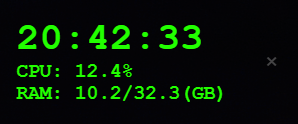

# Overlay

Simple transparent overlay meant to be kept running all the time. Shows time, cpu usage, ram usage, and cpu temperature.

## Summary:

This simple transparent overlay is always on top, cant be resized accidentaly (only by changing the source code), and can be closed with a single click, while also being draggable around the screen quite easily.

Currently shows Time (HH:MM:SS, 24-hour format), CPU and Ram usage. There is a small 'x' symbol, to close it. By default, will automatically run on startup, can be seen on the "startup" tab on Windows 10 Task Manager.

There is also a small C button below the X button. This is used to randomly alter the color of the overlay. This color is saved in local storage, and should persist between sessions. Also, if you would like to revert to the original color, simply right-click the C.

## Example:

## Build and use:

First, install dependencies and run the build:

    $ npm install
    $ npm run make

Then, find and run the 'setup.exe' file, in the 'out' directory. For example:

    $ & ".\out\make\squirrel.windows\x64\Overlay-1.0.1 Setup.exe"

Running this will create a shortcut, install the app (really just tells the OS about it, all the files are still in the repository folder), and set it up to run on startup.

## Known Issues:

I have not tested this on anything other than my own Windows 10 computer, and have no clue if it will work on Linux or MacOS. MacOS will need an additional package not included here, as per the 'systeminformation' package description, find out more [here](https://systeminformation.io/cpu.html).

The startup is also a little buggy, this is being worked on.

The overlay can't be put over games and other applications in fullscreen mode or borderless windowed mode. Don't know why yet, will lok into in the future. UPDATE: apparently this is mostly an OS limitation, I made some tweaks to make it appear over as much stuff as possible, but the way fullscreen works kinda blocks windows over them, and there's not much more I can do about it.

## To-Do:

- [ ] Fix startup
- [x] Hide from alt-tab menu and taskbar
- [x] Look into not showing over fullscreen applications (such as games in fullscreen/borderless)

## Acknowledgements

I could not have this project as easily or as quickly without [this guide](https://www.youtube.com/watch?v=zWuuk_j1iwM&ab_channel=tylerlaceby) from tyleraceby on youtube. Guy is an absolute legend, I appreciate the time he spent to share his experience very much.

This project is completely open and free (MIT License), so please, share and use this!
